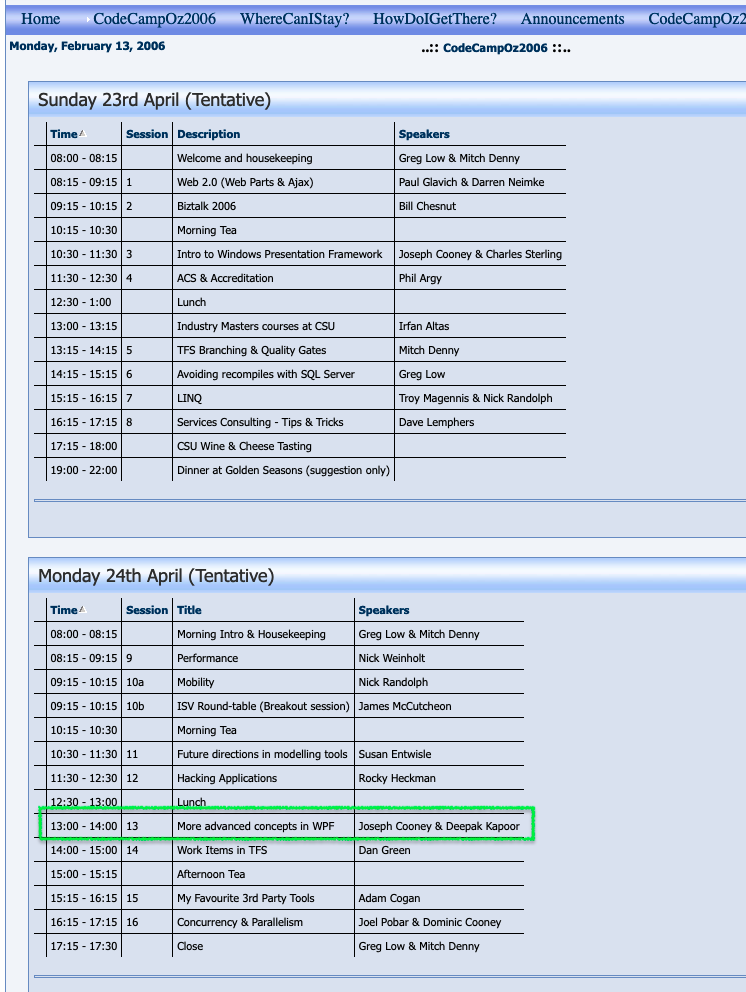

Title: Codecamp OZ: A Nostalgic Dive Into The Archives of the Web
Date: 2024-01-14
Tags: Community
Featured_Image: writing.png
Summary: 

I often think how fascinating it would be if the entire World Wide Web disappeared, leaving only the Wayback Machine behind. It's truly a remarkable tool and I could live with that.

Today, while going down the internet rabbit hole, I rediscovered the long-lost website of Codecamp OZ on the Wayback Machine. Codecamp was this two-day event that began in 2005. I believe, its final gathering was in 2008.

In Australia, April 25th is ANZAC Day, often part of a long weekend. What better way to spend it than at a geeky event like Codecamp? Yes, I know what you might be thinking, and I won't argue. There could have been 'better' ways to spend a long weekend, but let's face it: coding has its own addictive charm.

Not only did I attend Codecamp, but I also had the thrill of presenting there. My topic was “More Advanced Concepts in WPF,” which I co-presented with Joseph Cooney – shout out to Joseph!

It's been quite some time since I've done any public speaking, and I don't plan on diving back into it soon. However, there's a special kind of joy in this nostalgic journey, revisiting memories of times spent immersed in coding and community.

#8
