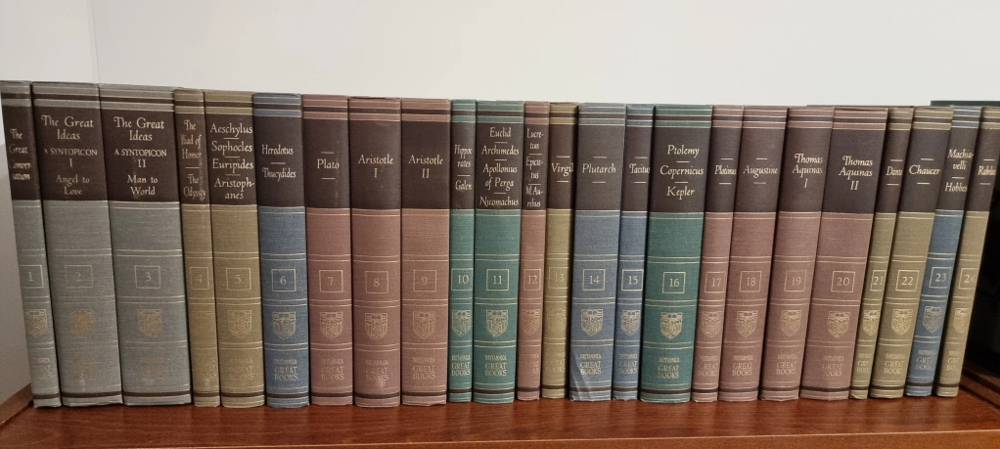
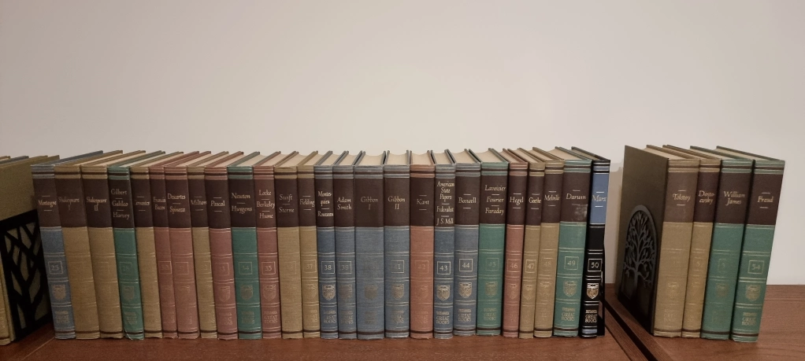

Few days ago I ordered [Great Books of the Western World](https://en.wikipedia.org/wiki/Great_Books_of_the_Western_World) and the books arrived two days ago. It is set of **54 volumes** by Encyclopedia Britannica first printed in 1952. The set I ordered is the 1952 edition. Only volume 50 is from a later edition.

I will refer to The Great Books of Western World as **GBWW** in this post and on this website.

I received the books two days ago and unpacked them yesterday with the enthusiasm of a kid in a candy store. Here is the set on my bookshelf.

I also ordered another set of books called The Great Ideas Program Series which according to a post on Reddit is this:

<blockquote>The Great Ideas Program is a series of syntopical reading plans and guides intended to assist the solitary reader in approaching the Great Books of the Western World Series without the benefit of a teacher or discussion group
<footer>Reddit User</footer>
</blockquote>

I expect The Great Ideas Program Series to arrive towards the end of February 2024.

Getting a liberals arts education has been a dream of mine and after doing extensive research, I figured that reading these books will give me the necessary foundation. It is a huge task and I’m giving myself approximately **10 years** to accomplish it.

I want to read for maximum understanding. I’ll take my time with each book and not rush through it.

## My Reading Plan

Before I start reading the great works, I want to sharpen my reading skills. For this, I will start with [How to Read a Book](https://en.wikipedia.org/wiki/How_to_Read_a_Book) by Mortimer Adler. This, I believe will help me pick up the essential reading skills which I will need to make my way through GBWW.

I will start reading them in the order they are i.e. start with volume 1 and make my way to volume 54. However, it is not certain and I may change this.

The Great Ideas Program may also influence how I read GBWW and I will change accordingly.

## Why am I Posting about this Online?

The idea is to use this website as a log of my reading the Great Books. I will collect my notes on the books here and use it as a thinking tool.

Why am I posting this online?

1. For my notes to remain online and accessible to me or anyone else
   2, In the hope of getting feedback from other readers and admirers of good books
2. To improve my writing skills
3. To establish connections

Another distant goal is that maybe someone else will also get inspired to pursue the path of life-long learning. From experience I can tell you that, it is a lot of fun.

I am looking forward to reading the books and in the process learn a thing or two.
